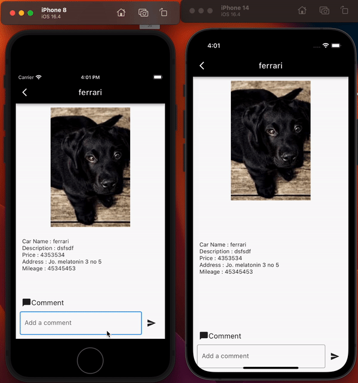

untuk menjalankan di lokal lakukan flutter run dengan asumsi memiliki ios emulator atau android emulator

untuk melakukan penggantian ipserver ke file bernama :

- globals.dart

  String ipnumber =<ipnumber dan port yang akan digunakan>

pada comment dapat diuji dengan dua emulator

dapat dilihat seperti video dibawah ini

